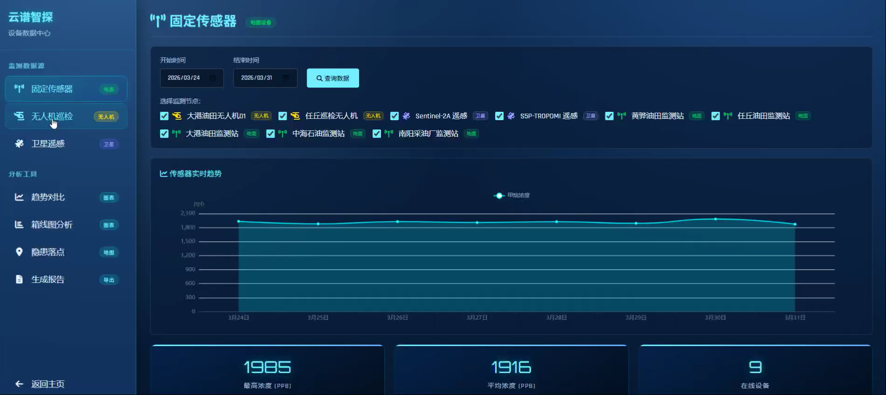
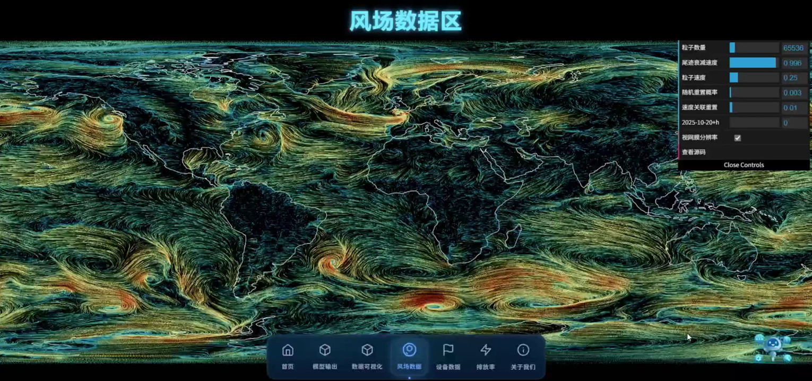
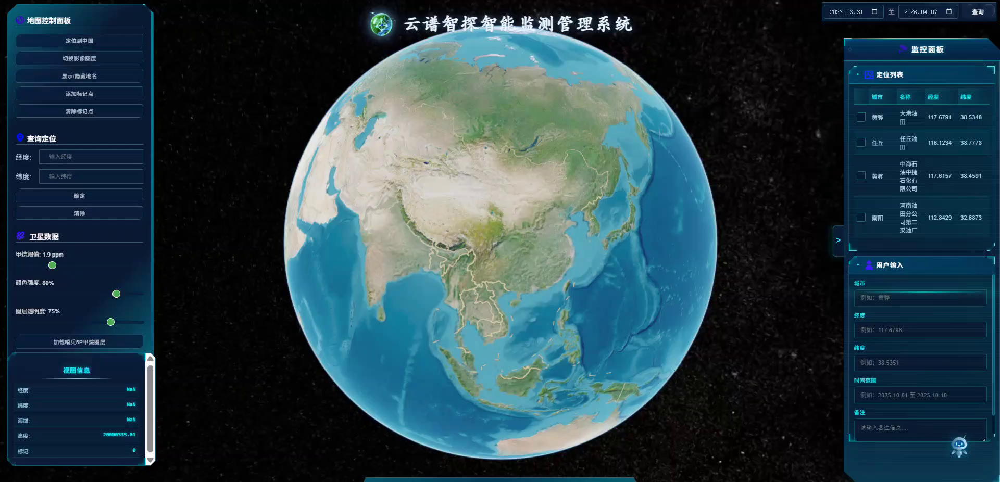
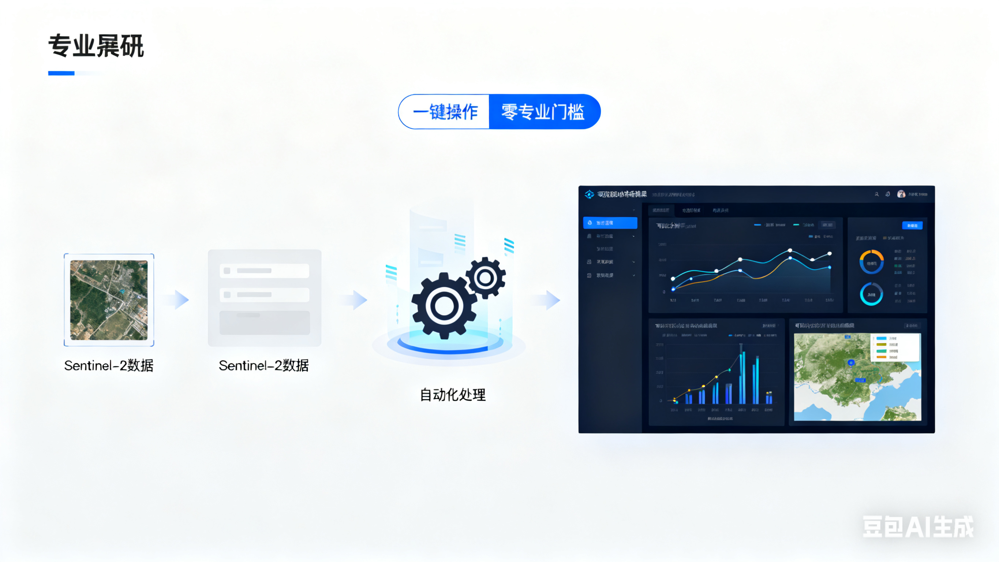
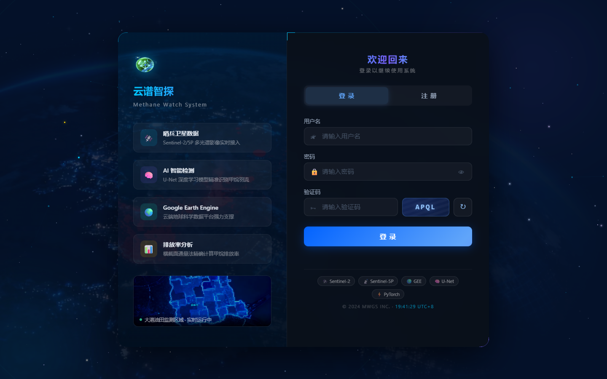
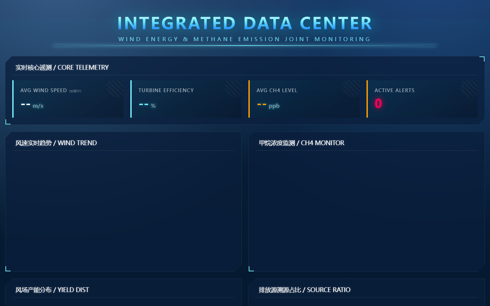
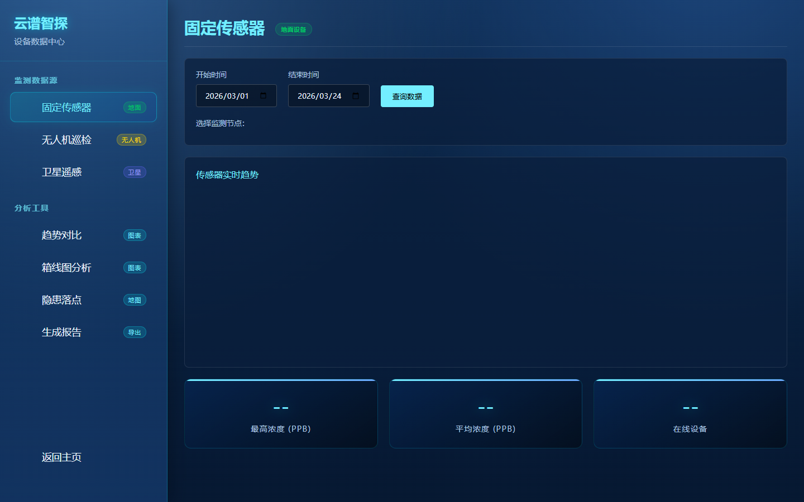

# 云谱智探

云谱智探是面向生态环境遥感监测与 AI 分析的综合平台，整合前端可视化、后端接口、遥感数据处理、智能问答和监测结果管理等能力。

## 项目简介

项目围绕生态环境监测、遥感数据解译、甲烷排放识别与风险分析等场景展开，支持从数据查询、结果展示到智能分析辅助的完整业务流程。

## 主要功能

- 前端可视化页面与业务交互
- FastAPI/Flask 后端服务接口
- AI 助手与多步骤分析流程
- 遥感数据查询、处理与结果展示
- 用户登录、管理和结果记录模块
- Google Earth Engine、地图服务和大模型能力的统一配置入口

## 项目结构

```text
backend/        后端服务、路由、工具函数
frontend/       前端页面、样式与脚本
requirements.txt Python 依赖
run_backend.bat 后端启动脚本
run_frontend.bat 前端启动脚本
docs/           效果图说明
```

## 效果预览

以下为系统运行界面截图，完整截图见 [docs/preview.md](docs/preview.md)。
















## 配置说明

- 本地运行前请参考 `backend/.env.example` 配置 GEE、地图服务和大模型相关环境变量。
- 数据库、模型权重、遥感影像和运行缓存建议放在本地数据目录中管理。
- 依赖目录、安装包、日志、缓存和模型输出等运行产物不纳入版本管理。

## 版权说明

如需复用代码、界面素材或文档内容，请先取得作者许可。