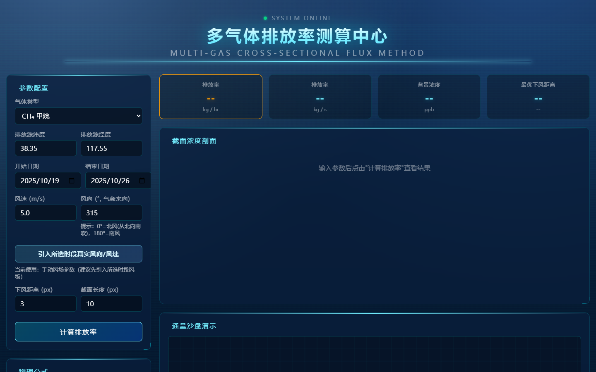
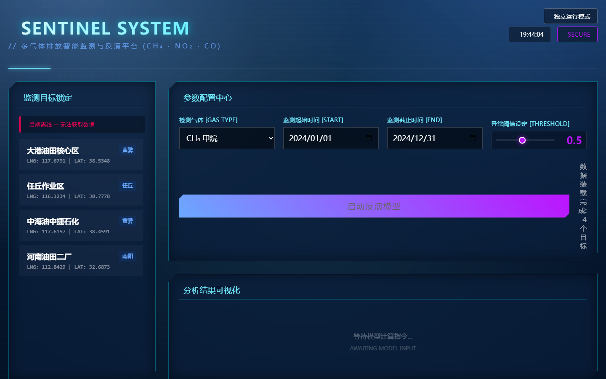
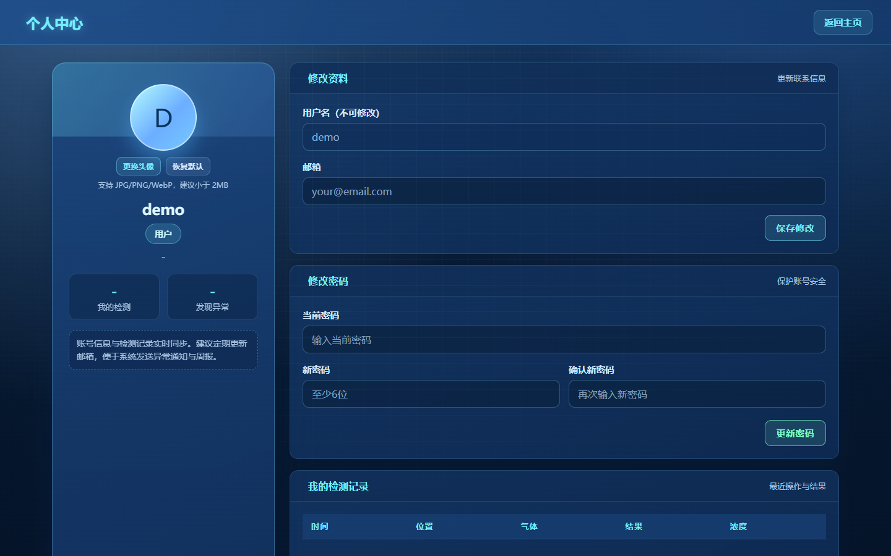
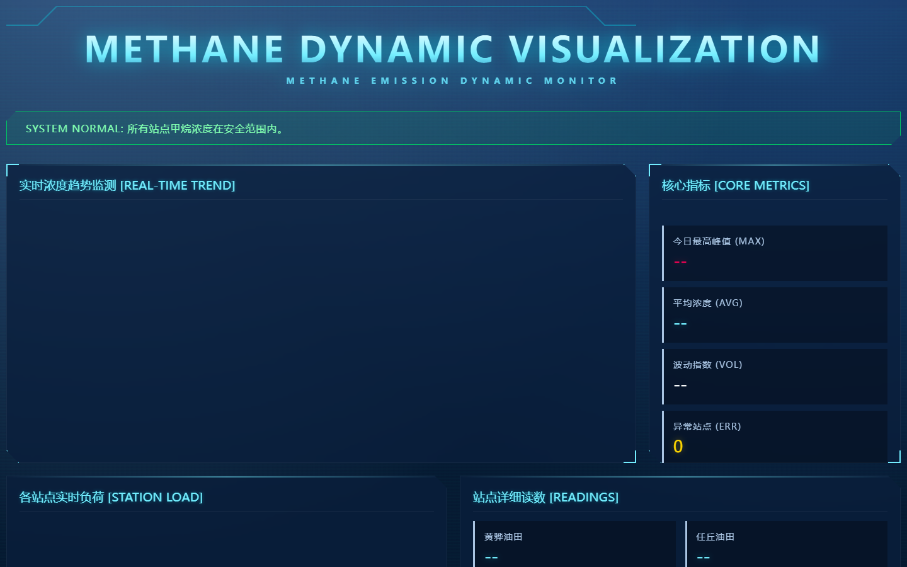
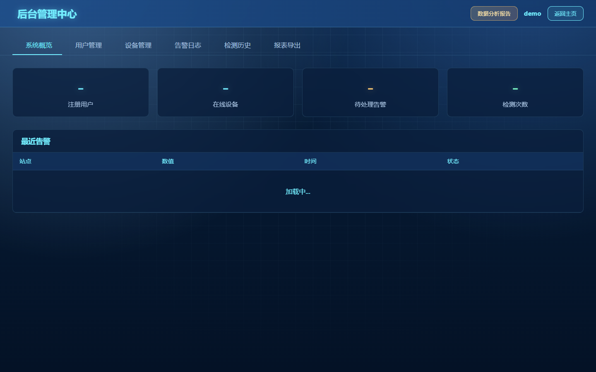
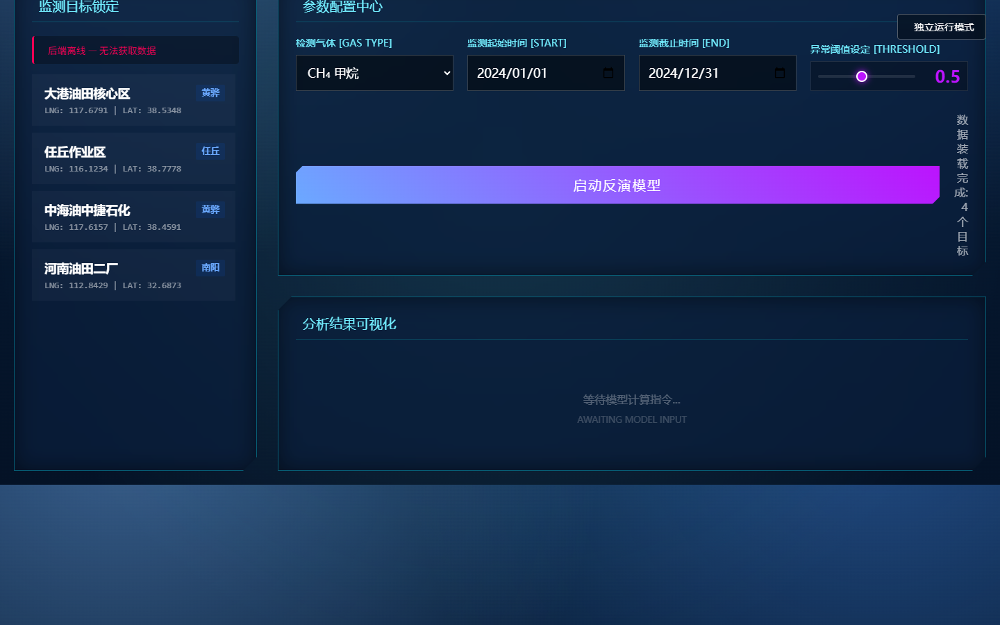
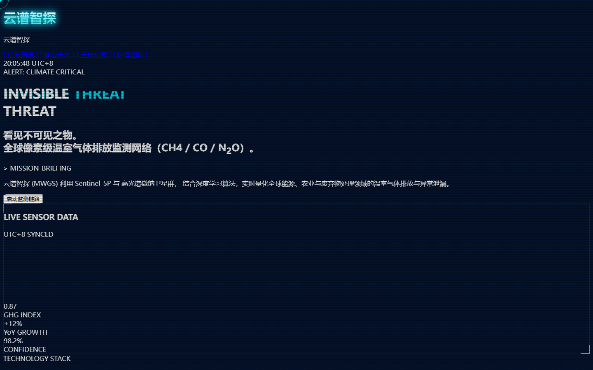

# 云谱智探系统预览

以下为平台登录、遥感监测、风场数据、地球可视化、后台管理、数据中心、通量测算、Sentinel 参数配置、个人中心等系统界面截图。

## 系统预览 01

## 系统预览 02

## 系统预览 03

## 系统预览 04

## 系统预览 05

## 系统预览 06

## 系统预览 07

## 系统预览 08

## 系统预览 09

## 系统预览 10

## 系统预览 11

## 系统预览 12

## 系统预览 13

## 系统预览 14

## 系统预览 15

